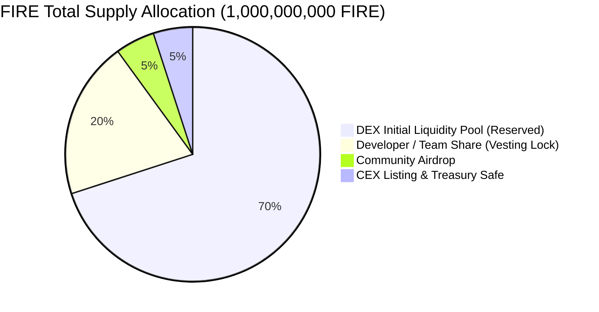

# 🔥 FIRE ($FIRE) Base Mainnet Deployment & Operations Report

**English** | **[한국어](FIRE_MAINNET_LAUNCH_REPORT.md)**

Complete post-deployment record, on-chain contract addresses, security verification status, Round 1 airdrop execution guide, and global community announcement templates for **FIRE ($FIRE)** on **Base (Ethereum L2, Chain ID: 8453)**.

---

## 1. Official Token Specifications

| Parameter | Specification |
| :--- | :--- |
| **Token Name** | Fire |
| **Symbol** | **FIRE** |
| **Decimals** | 18 |
| **Total Supply** | **1,000,000,000 FIRE** (Fixed 1 Billion cap, no mint function) |
| **Network** | **Base Mainnet (Chain ID: 8453)** |
| **Deployment Block** | `52378678` |
| **Deployment Timestamp** | 2026-10-09 11:51:57 UTC |
| **Gas Cost** | ~**0.0000107 ETH (< $0.05)** |
| **Smart Contract Standard** | OpenZeppelin Contracts v5.7.0, Zero privileged entities (`no owner()`, no mint, no tax, no blacklist, no pause, no upgrade) |

---

## 2. Official On-Chain Addresses & BaseScan Links

> [!IMPORTANT]
> The addresses below are permanently recorded on the Base blockchain. All token transfers, vesting schedules, and multisig actions can be verified transparently on BaseScan.

| Role | Address | BaseScan Link | Description |
| :--- | :--- | :---: | :--- |
| **FIRE Token** | `0xCB357A1A388a71cF4d54D3649D02bd5182c2b2E0` | [BaseScan](https://basescan.org/address/0xCB357A1A388a71cF4d54D3649D02bd5182c2b2E0) | Official immutable ERC-20 contract |
| **Team Vesting** | `0xD579bF53E084eF8f6C130F6D35844d490bF18290` | [BaseScan](https://basescan.org/address/0xD579bF53E084eF8f6C130F6D35844d490bF18290) | 180-day cliff (0 tokens) + 540-day linear release |
| **Treasury Safe** | `0x2fb79a099B7579F486F073D78e75fbCD6Ce76Ef6` | [BaseScan](https://basescan.org/address/0x2fb79a099B7579F486F073D78e75fbCD6Ce76Ef6) | 2-of-3 Base Safe Multisig |
| **Airdrop Wallet** | `0xA6b3a10C51E57bcda89B89B6E7aed73e646Fa449` | [BaseScan](https://basescan.org/address/0xA6b3a10C51E57bcda89B89B6E7aed73e646Fa449) | Dedicated Round 1 & 2 Merkle distributor funder |
| **Deployer Wallet** | `0xB0015faBc8456a39c0A114A5a6e0363C9589B66f` | [BaseScan](https://basescan.org/address/0xB0015faBc8456a39c0A114A5a6e0363C9589B66f) | Holds 700M FIRE reserved for DEX LP pool creation |
| **Vesting Beneficiary**| `0x5eB6293A028e8958fEE345ff973CD6DCC1555711` | [BaseScan](https://basescan.org/address/0x5eB6293A028e8958fEE345ff973CD6DCC1555711) | FireVesting owner & recipient wallet |

---

## 3. Token Allocation Breakdown (100% On-Chain Verified)



| Allocation | Amount (FIRE) | Ratio | Execution & On-Chain Status |
| :--- | ---: | :---: | :--- |
| **DEX Liquidity** | 700,000,000 | 70% | Securely held in deployer wallet for community pool seeding |
| **Developer Vesting** | 200,000,000 | 20% | Locked in `FireVesting` contract (0 releasable until April 7, 2027) |
| **Community Airdrop** | 50,000,000 | 5% | Transferred to `AIRDROP_WALLET` (Round 1: 20M, Round 2: 30M) |
| **CEX & Treasury** | 50,000,000 | 5% | Transferred to 2-of-3 Base Safe multisig vault |

---

## 4. Post-Deployment Audit Report (`PostDeployCheck`)

Automated post-deployment verification script executed on live Base Mainnet:
* **Result: `RESULT: PASS (21 passed / 0 warned / 0 failed)`**
* **Verified Core Invariants:**
  1. `FireToken.owner()` absent: zero backdoors, zero blacklist, zero transfer fees, zero arbitrary burn capability.
  2. `FireToken` runtime bytecode exact match with compiled local source.
  3. `FireVesting` schedule verified: `releasable == 0` during the 180-day cliff.
  4. `TREASURY_SAFE` verified: 3 owners, threshold 2, 0 malicious modules enabled.
  5. Deployment record synchronization: `deployments/8453.json` (`status: confirmed`).

---

## 5. Source Code Verification Status

### ① Sourcify Verification (Completed ✅)
* **FireToken:** `Status: exact_match` ([Sourcify](https://sourcify.dev/server/verify-ui/jobs/fafcfacc-3ebb-433b-895a-20cb7cfc0cf4))
* **FireVesting:** `Status: exact_match` ([Sourcify](https://sourcify.dev/server/verify-ui/jobs/40a04b18-0509-43bc-8bac-39c1e4d360d1))

### ② BaseScan Direct Verification Command (Green Checkmark)
With an API key from [Etherscan/BaseScan](https://basescan.org) added to `.env` as `ETHERSCAN_API_KEY`:
```bash
# Verify FireToken on BaseScan
forge verify-contract 0xCB357A1A388a71cF4d54D3649D02bd5182c2b2E0 src/FireToken.sol:FireToken \
  --chain 8453 --verifier etherscan --watch \
  --constructor-args 0x000000000000000000000000d579bf53e084ef8f6c130f6d35844d490bf18290

# Verify FireVesting on BaseScan
forge verify-contract 0xD579bF53E084eF8f6C130F6D35844d490bF18290 src/FireVesting.sol:FireVesting \
  --chain 8453 --verifier etherscan --watch \
  --constructor-args 0x0000000000000000000000005eb6293a028e8958fee345ff973cd6dcc15557110000000000000000000000000000000000000000000000000000000000ed4e000000000000000000000000000000000000000000000000000000000002c7ea00
```

---

## 6. Round 1 Merkle Airdrop Workflow

The airdrop wallet (`0xA6b3a10C...`) is pre-funded with **50,000,000 FIRE** and execution gas (`0.001 ETH`).

### Step 1: Prepare Recipient CSV (`airdrop/round1.csv`)
Round 1 allocation is **20,000,000 FIRE**. Create `airdrop/round1.csv`:
```csv
address,amount
0xRecipientAddress1,10000000
0xRecipientAddress2,5000000
0xRecipientAddress3,5000000
```
*(Total sum must exactly equal 20,000,000)*

### Step 2: Generate and Verify Merkle Tree
```bash
cd airdrop
node generate.mjs --input round1.csv --out out/round-1 --expected-total 20000000 --round 1
cd ..
```

### Step 3: Deploy On-Chain Merkle Distributor
```bash
export AIRDROP_MERKLE_JSON=airdrop/out/round-1/merkle.json
export AIRDROP_WALLET=0xA6b3a10C51E57bcda89B89B6E7aed73e646Fa449
export AIRDROP_EXPECTED_ROOT=$(node -e "console.log(JSON.parse(fs.readFileSync('airdrop/out/round-1/merkle.json')).root)")

CONFIRM_MAINNET=I_UNDERSTAND forge script script/DeployAirdrop.s.sol:DeployAirdrop \
  --rpc-url https://mainnet.base.org \
  --private-key <AIRDROP_WALLET_PRIVATE_KEY> \
  --broadcast --slow
```

---

## 7. Global Community Announcement Templates

### 📢 X (Twitter) Announcement
```text
🔥 $FIRE Token is Officially Live on Base! 🚀

A fair launch, community-first utility token built on Base (Ethereum L2) with ZERO presale and ZERO admin keys.

🪙 Token Overview:
• Symbol: $FIRE
• Network: Base (Chain ID: 8453)
• Contract: 0xCB357A1A388a71cF4d54D3649D02bd5182c2b2E0
• Total Supply: 1,000,000,000 FIRE (Fixed Cap)

🛡️ Transparency & Safety:
• No Owner / No Mint / No Tax / No Blacklist
• Team Vesting: 20% locked on-chain (6-month cliff)
• Treasury: 5% in 2-of-3 Base Safe Multisig
• Airdrop: 50,000,000 $FIRE reserved for real users

🔍 BaseScan: https://basescan.org/address/0xCB357A1A388a71cF4d54D3649D02bd5182c2b2E0
🏦 Multisig Safe: https://basescan.org/address/0x2fb79a099B7579F486F073D78e75fbCD6Ce76Ef6
🌐 Website: https://fire-token.github.io

#FIRE #Base #FairLaunch #Ethereum #DeFi
```

---

### 📢 Telegram / Discord Global Announcement
```text
🔥 [FIRE Token Official Base Mainnet Launch] 🔥

We are excited to announce that FIRE ($FIRE) is now live on Base Mainnet!

FIRE is built with transparent smart contract invariants to eliminate rug-pull vectors and admin privileges.

📌 Official Details:
• Name: Fire ($FIRE)
• Network: Base (Chain ID: 8453)
• Token Contract: 0xCB357A1A388a71cF4d54D3649D02bd5182c2b2E0
• Total Supply: 1,000,000,000 FIRE (Strictly fixed)

🔒 Key Guarantees:
1. Pure Immutable ERC-20: No owner, no taxes, no minting, no pauses.
2. Provable Team Vesting: 20% team allocation is locked in an immutable on-chain vesting contract with a 180-day cliff.
3. Multisig Treasury: 5% is safeguarded in a 2-of-3 Base Safe.
4. Community Airdrop: Round 1 Merkle distribution opening soon.

🔗 Verified Links:
• Official Website: https://fire-token.github.io
• BaseScan: https://basescan.org/address/0xCB357A1A388a71cF4d54D3649D02bd5182c2b2E0
• Treasury Vault: https://basescan.org/address/0x2fb79a099B7579F486F073D78e75fbCD6Ce76Ef6
• GitHub: https://github.com/Fire-token/fire-contracts
```

---

## 8. Adding $FIRE to MetaMask

1. Open MetaMask and ensure your network is set to **Base**.
2. Click **Import Tokens** at the bottom of the assets tab.
3. Paste the official FIRE contract address:
   ```text
   0xCB357A1A388a71cF4d54D3649D02bd5182c2b2E0
   ```
4. Token Symbol (`FIRE`) and Decimals (`18`) will populate automatically. Click **Next** $\rightarrow$ **Import**.

