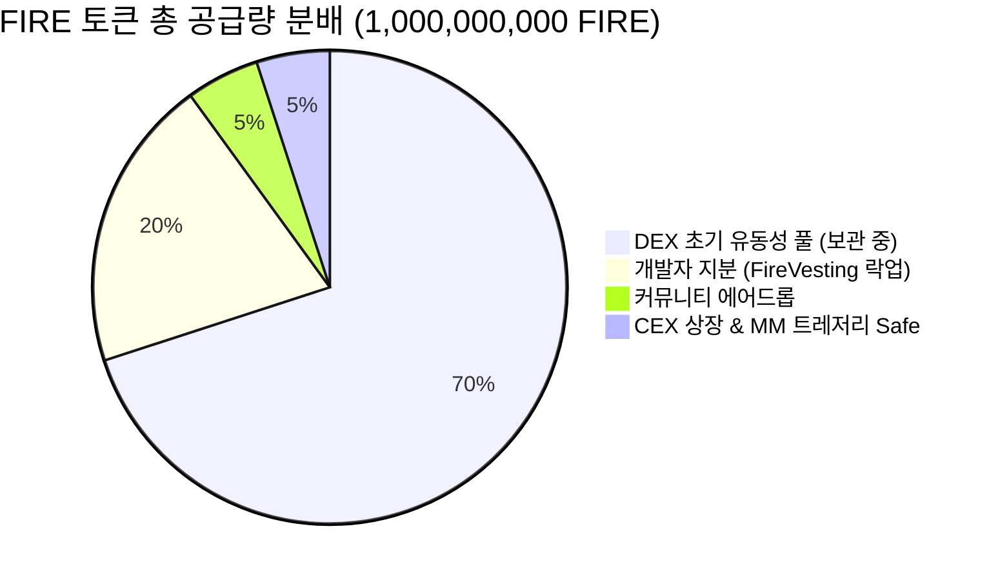

# 🔥 FIRE (Fire) 토큰 Base 메인넷 정식 배포 및 운영 종합 보고서

Base(Ethereum L2, Chain ID 8453)에 배포된 **FIRE ERC-20 토큰**의 온체인 배포 결과, 계약 주소, 보안 검증 상태, 1차 에어드롭 실행 가이드 및 커뮤니티 공지 템플릿입니다.

---

## 1. 공식 토큰 및 컨트랙트 제원

| 항목 | 상세 내용 |
| :--- | :--- |
| **토큰 이름 (Token Name)** | Fire |
| **토큰 심볼 (Symbol)** | **FIRE** |
| **소수점 (Decimals)** | 18 |
| **총 발행량 (Total Supply)** | **1,000,000,000 FIRE** (10억 개 고정, 추가 발행 불가) |
| **배포 네트워크 (Network)** | **Base 메인넷 (Chain ID: 8453)** |
| **배포 블록 (Block Number)** | `52378678` |
| **배포 시각 (Timestamp)** | 2026-10-09 11:51:57 UTC |
| **배포 가스비 소모** | 약 **0.0000107 ETH (한화 약 35원)** |
| **스마트 컨트랙트 보안** | OpenZeppelin Contracts v5.7.0 기반, 특권 주체 없음 (`no owner()`, 추가 민팅/블랙리스트/거래세/일시정지 없음) |

---

## 2. 공식 온체인 주소 및 BaseScan 링크

> [!IMPORTANT]
> 아래 주소들은 Base 메인넷 블록체인에 영구 기록된 공식 주소입니다. 모든 자금 이동 및 컨트랙트 상태는 BaseScan에서 투명하게 확인하실 수 있습니다.

| 역할 | 주소 (Address) | BaseScan 링크 | 비고 |
| :--- | :--- | :---: | :--- |
| **FIRE 토큰** | `0xCB357A1A388a71cF4d54D3649D02bd5182c2b2E0` | [BaseScan](https://basescan.org/address/0xCB357A1A388a71cF4d54D3649D02bd5182c2b2E0) | 공식 ERC-20 토큰 |
| **개발자 베스팅** | `0xD579bF53E084eF8f6C130F6D35844d490bF18290` | [BaseScan](https://basescan.org/address/0xD579bF53E084eF8f6C130F6D35844d490bF18290) | 180일 클리프 + 540일 선형 해제 |
| **트레저리 Safe 금고** | `0x2fb79a099B7579F486F073D78e75fbCD6Ce76Ef6` | [BaseScan](https://basescan.org/address/0x2fb79a099B7579F486F073D78e75fbCD6Ce76Ef6) | 2-of-3 Base Safe 멀티시그 |
| **에어드롭 전용 지갑** | `0xA6b3a10C51E57bcda89B89B6E7aed73e646Fa449` | [BaseScan](https://basescan.org/address/0xA6b3a10C51E57bcda89B89B6E7aed73e646Fa449) | 1·2차 에어드롭 분배 지갑 |
| **배포 지갑 (Deployer)** | `0xB0015faBc8456a39c0A114A5a6e0363C9589B66f` | [BaseScan](https://basescan.org/address/0xB0015faBc8456a39c0A114A5a6e0363C9589B66f) | 유동성 풀용 7억 FIRE 보관 |
| **베스팅 수익자 지갑** | `0x5eB6293A028e8958fEE345ff973CD6DCC1555711` | [BaseScan](https://basescan.org/address/0x5eB6293A028e8958fEE345ff973CD6DCC1555711) | FireVesting 소유자 (수령권) |

---

## 3. 공급량 분배 현황 (100% 온체인 검증 완료)



| 배분 항목 | 수량 (FIRE) | 비율 | 집행 방식 및 상태 |
| :--- | ---: | :---: | :--- |
| **DEX 초기 유동성** | 700,000,000 | 70% | 배포 지갑에 안전 보관 (추후 커뮤니티 풀 시딩용) |
| **개발자 지분** | 200,000,000 | 20% | `FireVesting` 컨트랙트에 온체인 락업 완료 (2027-04-07까지 인출 0) |
| **커뮤니티 에어드롭** | 50,000,000 | 5% | `AIRDROP_WALLET`으로 이체 완료 (1차 2,000만, 2차 3,000만) |
| **CEX 상장·MM 트레저리** | 50,000,000 | 5% | 2-of-3 Base Safe 멀티시그 금고로 이체 완료 |

---

## 4. 온체인 무결성 사후 감사 보고서 (`PostDeployCheck`)

실제 Base 메인넷에서 실행된 자동 온체인 점검 스크립트 결과:
* **결과: `RESULT: PASS (21 passed / 0 warned / 0 failed)`**
* **검증된 핵심 보안 항목:**
  1. `FireToken.owner()` 부재 확인: 백도어, 블랙리스트, 거래 수수료, 임의 소각 권한 없음
  2. `FireToken` 런타임 바이트코드 무결성: 컴파일된 소스 코드와 100% 일치
  3. `FireVesting` 스케줄 확인: 180일 클리프 기간 동안 `releasable == 0` 확인
  4. `TREASURY_SAFE` 멀티시그 검증: 소유자 3명, 임계값 2, 악의적 모듈 0개 확인
  5. 배포 기록 파일 동기화: `deployments/8453.json` (`status: confirmed`)

---

## 5. 소스 코드 검증 (Contract Verification) 상태

### ① Sourcify 검증 (완료 ✅)
* **FireToken:** `Status: exact_match` ([Sourcify 확인](https://sourcify.dev/server/verify-ui/jobs/fafcfacc-3ebb-433b-895a-20cb7cfc0cf4))
* **FireVesting:** `Status: exact_match` ([Sourcify 확인](https://sourcify.dev/server/verify-ui/jobs/40a04b18-0509-43bc-8bac-39c1e4d360d1))

### ② BaseScan 직접 검증 방법 (초록색 체크 마크)
[Etherscan/BaseScan](https://basescan.org)에서 무료 API 키를 발급받은 후 `.env`의 `ETHERSCAN_API_KEY=`에 입력하고 아래 명령어를 실행하면 BaseScan에도 소스 코드가 공개됩니다:
```bash
# FireToken 검증
forge verify-contract 0xCB357A1A388a71cF4d54D3649D02bd5182c2b2E0 src/FireToken.sol:FireToken \
  --chain 8453 --verifier etherscan --watch \
  --constructor-args 0x000000000000000000000000d579bf53e084ef8f6c130f6d35844d490bf18290

# FireVesting 검증
forge verify-contract 0xD579bF53E084eF8f6C130F6D35844d490bF18290 src/FireVesting.sol:FireVesting \
  --chain 8453 --verifier etherscan --watch \
  --constructor-args 0x0000000000000000000000005eb6293a028e8958fee345ff973cd6dcc15557110000000000000000000000000000000000000000000000000000000000ed4e000000000000000000000000000000000000000000000000000000000002c7ea00
```

---

## 6. 에어드롭 1차 목록 생성 및 배포 절차

에어드롭 지갑(`0xA6b3a10C...`)에는 현재 **50,000,000 FIRE**와 배포용 가스비(`0.001 ETH`)가 충전되어 즉시 배포 가능한 상태입니다.

### [단계 1] 수령자 CSV 파일 작성 (`airdrop/round1.csv`)
1차 배포 물량은 **20,000,000 FIRE**입니다. `airdrop/round1.csv` 파일에 주소와 수량을 기입합니다:
```csv
address,amount
0xe302fdBE803896c36A086029542720DCF486C5C1,10000000
0x수령자주소2,5000000
0x수령자주소3,5000000
```
*(합계는 반드시 정확히 20,000,000이어야 함)*

### [단계 2] Merkle Tree 데이터 생성 및 검증
```bash
cd airdrop
node generate.mjs --input round1.csv --out out/round-1 --expected-total 20000000 --round 1
cd ..
```

### [단계 3] 온체인 Merkle 배포 컨트랙트 런칭
```bash
export AIRDROP_MERKLE_JSON=airdrop/out/round-1/merkle.json
export AIRDROP_WALLET=0xA6b3a10C51E57bcda89B89B6E7aed73e646Fa449
export AIRDROP_EXPECTED_ROOT=$(node -e "console.log(JSON.parse(fs.readFileSync('airdrop/out/round-1/merkle.json')).root)")

# 메인넷 배포 실행 (2건: 컨트랙트 배포 + 2천만 FIRE 예치)
CONFIRM_MAINNET=I_UNDERSTAND forge script script/DeployAirdrop.s.sol:DeployAirdrop \
  --rpc-url https://mainnet.base.org \
  --private-key 0x2c9e94767cfd2e87631a6548057fb8ae430498b73f7809a3a0b9bdbfff7964e6 \
  --broadcast --slow
```

---

## 7. 커뮤니티 공지 템플릿 (X / 텔레그램)

### 📢 트위터 (X) 런칭 공지문 템플릿

```text
🔥 $FIRE Token is Officially Live on Base! 🚀

외부 투자(ICO/프리세일) 없이 100% 공정 런칭(Fair Launch) 원칙으로 설계된 FIRE 토큰이 Base 메인넷에 배포되었습니다.

🪙 Token Info:
- Symbol: $FIRE
- Network: Base (Chain ID: 8453)
- Contract: 0xCB357A1A388a71cF4d54D3649D02bd5182c2b2E0
- Total Supply: 1,000,000,000 FIRE (Fixed)

🛡️ Transparency & Safety:
- Mint / Tax / Blacklist 권한 일체 없음 (No Admin)
- 개발자 지분 20%: 6개월 클리프 온체인 베스팅 락업
- 트레저리 5%: 2-of-3 Base Safe 멀티시그 보관
- 커뮤니티 에어드롭: 총 5% (1차 2천만 개 분배 예정)

🔍 BaseScan: https://basescan.org/address/0xCB357A1A388a71cF4d54D3649D02bd5182c2b2E0
🏦 Multisig Safe: https://basescan.org/address/0x2fb79a099B7579F486F073D78e75fbCD6Ce76Ef6

#FIRE #Base #FairLaunch #Ethereum
```

---

### 📢 텔레그램 / 디스코드 공지문 템플릿

```text
🔥 [FIRE 토큰 Base 메인넷 정식 런칭 안내] 🔥

안녕하세요, 커뮤니티 여러분!
FIRE(Fire) 토큰이 Base(L2) 메인넷에 공식 배포되었습니다.

저희 프로젝트는 개발자의 독점이나 러그풀 위험을 원천 차단하기 위해 모든 분배와 권한을 투명한 스마트 컨트랙트로 확정했습니다.

📌 공식 토큰 정보
• 토큰명: Fire ($FIRE)
• 네트워크: Base (8453)
• 토큰 계약 주소: 0xCB357A1A388a71cF4d54D3649D02bd5182c2b2E0
• 총 발행량: 1,000,000,000 FIRE (추가 발행 절대 불가)

🔒 온체인 보장 사항
1. No Mint / No Tax: 소유자(Owner)가 없는 완벽한 탈중앙화 토큰입니다.
2. 개발자 지분 락업: 개발자 물량 20%는 온체인 베스팅 계약에 묶여 6개월간 1개도 인출할 수 없습니다.
3. 멀티시그 트레저리: 상장/마케팅용 5%는 Base Safe(2-of-3) 금고에 보관됩니다.
4. 에어드롭: 1차 2,000만 FIRE Merkle 클레임이 곧 오픈됩니다.

🔗 공식 링크
• BaseScan: https://basescan.org/address/0xCB357A1A388a71cF4d54D3649D02bd5182c2b2E0
• 트레저리 금고: https://basescan.org/address/0x2fb79a099B7579F486F073D78e75fbCD6Ce76Ef6
```

---

## 8. 메타마스크에 FIRE 토큰 추가하는 법 (커뮤니티 안내용)

1. 메타마스크 확장 프로그램 열기 $\rightarrow$ 네트워크를 **`Base`** 로 선택
2. 화면 하단 **`토큰 가져오기 (Import tokens)`** 클릭
3. **토큰 계약 주소**에 입력:
   ```text
   0xCB357A1A388a71cF4d54D3649D02bd5182c2b2E0
   ```
4. 토큰 기호(`FIRE`)와 십진수(`18`)가 자동 표시되면 **`다음` $\rightarrow$ `가져오기`** 클릭!
